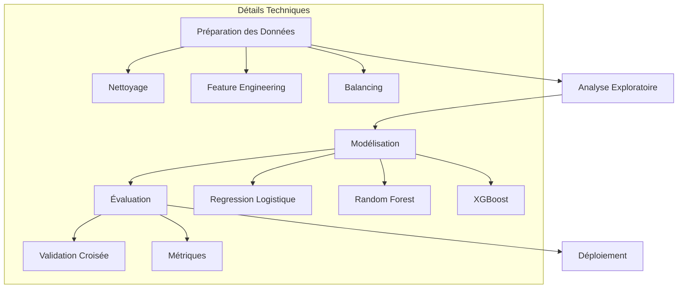
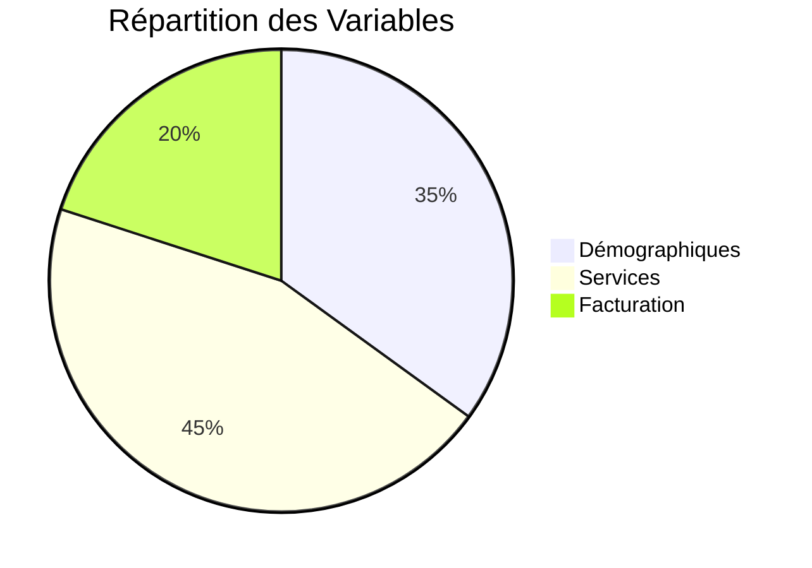
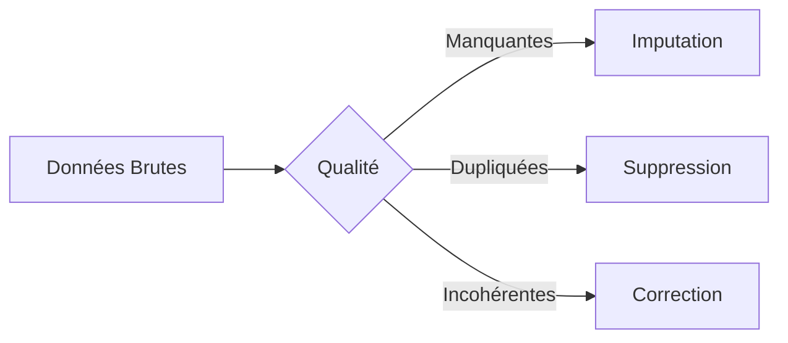
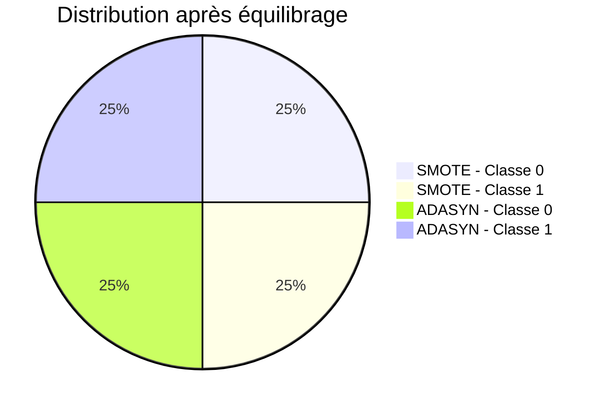
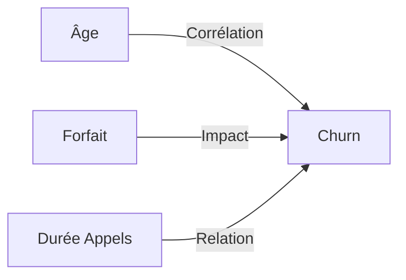
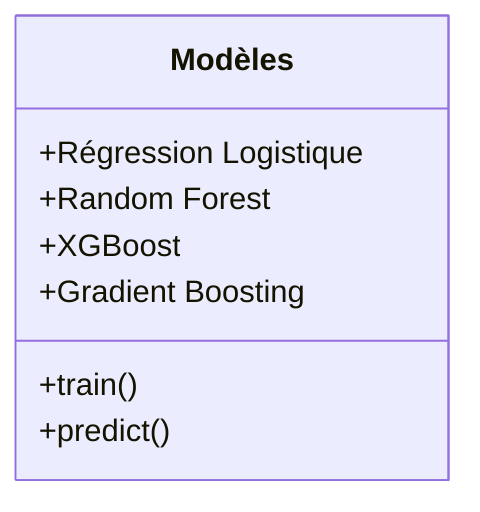
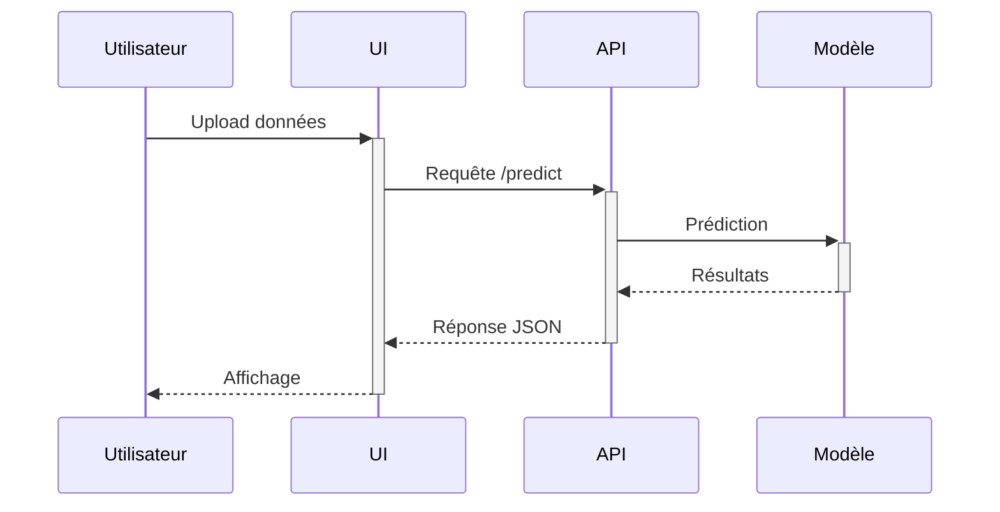

#  Projet de Prédiction du Churn Client

##  Objectif

Prédire le churn (désabonnement) des clients à partir de leurs données historiques dans le secteur des télécommunications, afin d’optimiser les campagnes de rétention.

---

##  Architecture Globale du Projet

---

##  Données

###  Sources
- Données historiques internes d’un opérateur télécom
- Données clients : démographie, services, facturation, utilisation

###  Répartition des Variables

---

##  Préparation des Données

- Imputation des valeurs manquantes
- Suppression des doublons
- Correction des incohérences
- Standardisation et encodage des variables

---

##  Rééquilibrage des Classes

- **SMOTE :** Génère des exemples synthétiques entre les plus proches voisins de la classe minoritaire.
- **ADASYN :** Génère plus d'exemples pour les observations difficiles à apprendre.

**Objectif :** Améliorer la capacité des modèles à détecter le churn.
---

##  Analyse Exploratoire

- Identification de variables fortement liées au churn
- Détection de corrélations utiles pour la modélisation

---

##  Modélisation

- Comparaison de plusieurs modèles supervisés
- Focus sur les algorithmes robustes aux données déséquilibrées

---

## Comparaison des Performances : SMOTE vs ADASYN

```mermaid
gantt
    title F1-Score selon la Technique de Rééquilibrage
    dateFormat  X
    axisFormat %s

    section SMOTE
    XGBoost : 0, 82
    Random Forest : 0, 80
    Logistique : 0, 75

    section ADASYN
    XGBoost : 0, 81
    Random Forest : 0, 78
    Logistique : 0, 74

``` 

- **SMOTE + XGBoost =** meilleures performances

- **ADASYN** légèrement moins performant sur tous les modèles
##  Évaluation des Modèles

```mermaid
gantt
    title Comparaison des Métriques (AUC-ROC)
    dateFormat  X
    axisFormat %s

    section AUC-ROC
    XGBoost : 0, 87
    Random Forest : 0, 85
    Regression Logistique : 0, 78

```

- Évaluation par **Validation Croisée**
- Meilleur compromis performance/interprétabilité avec **XGBoost**

---

##  Déploiement

- Création d’une **API de prédiction** accessible par une interface utilisateur
- Intégration dans les outils décisionnels de l'entreprise

---

## Conclusion
- Le projet a permis de concevoir un pipeline complet de prédiction du churn.

- **SMOTE** combiné à **XGBoost** a donné les meilleurs résultats.
